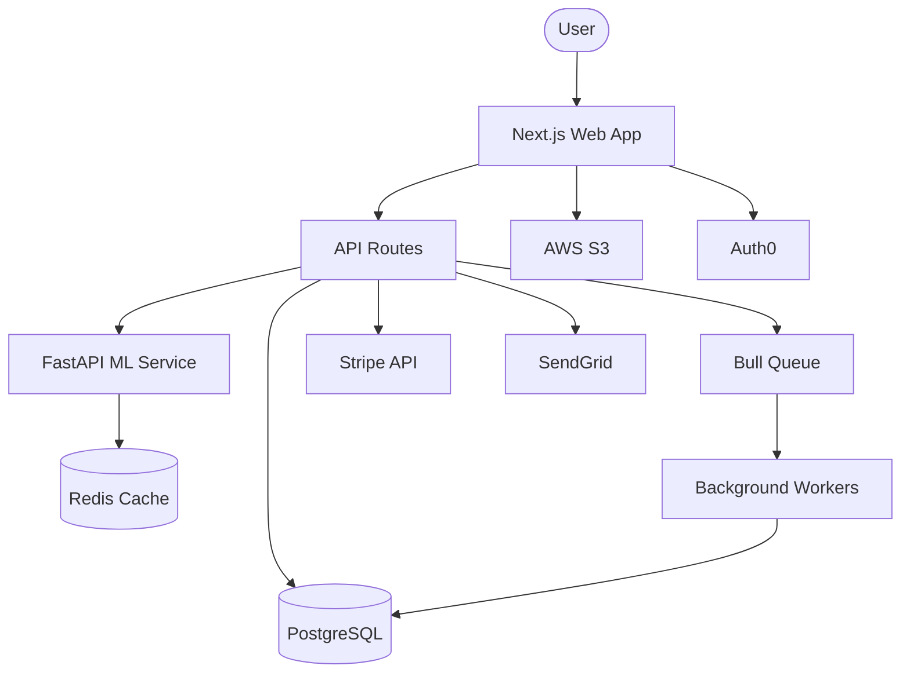

# Codebase Analysis Guide

Detailed checklist for Phase 1 exploration. Spawn parallel explore agents — one per section below. Each agent should save its findings as structured markdown.

---

## 1. Structure & Stack Analysis

**Goal:** Understand what the project is built with and how it's organized.

### Examine these files/locations:

```
package.json / package-lock.json / yarn.lock / pnpm-lock.yaml
requirements.txt / pyproject.toml / Pipfile / setup.py / setup.cfg
*.csproj / *.sln / Directory.Build.props / global.json
go.mod / go.sum
Cargo.toml / Cargo.lock
build.gradle / pom.xml / settings.gradle
Gemfile / Gemfile.lock
composer.json
Makefile / CMakeLists.txt
Dockerfile / docker-compose.yml / docker-compose.*.yml
```

### Capture:

- **Languages**: Primary and secondary languages with approximate percentages
- **Frameworks**: Web frameworks (React, Next.js, Express, Django, ASP.NET, Spring, etc.)
- **Package managers**: npm, yarn, pnpm, pip, NuGet, Maven, etc.
- **Build tools**: Webpack, Vite, esbuild, Turbopack, MSBuild, Gradle, etc.
- **Monorepo structure**: Nx, Turborepo, Lerna, or custom workspace config
- **Runtime targets**: Node.js version, .NET version, Python version, JDK version
- **Notable libraries**: ORM (Prisma, TypeORM, EF Core, SQLAlchemy), state management, UI component libraries, HTTP clients

### Output format:

```markdown
## Structure & Stack Profile

### Languages
- TypeScript (80%) — primary
- Python (15%) — scripts and ML pipeline
- SQL (5%) — migrations

### Frameworks
- Next.js 14 (App Router) — frontend + API routes
- FastAPI — ML service

### Package Management
- pnpm workspaces (monorepo)
- pip + pyproject.toml for Python

### Build System
- Turbopack (via Next.js)
- Docker multi-stage builds

### Key Libraries
- Prisma ORM, TanStack Query, Tailwind CSS, Zod, NextAuth.js
```

---

## 2. Architecture Analysis

**Goal:** Understand the system's shape — how components relate and data flows.

### Examine:

- Top-level directory structure (what are the major modules/services?)
- API route definitions (REST routes, GraphQL schema, gRPC proto files)
- Middleware and pipeline configurations
- Service layer organization
- Database connection and repository patterns
- Message broker or event bus configuration
- Shared code and internal packages
- Configuration management (env vars, config files, feature flags)

### Look for patterns:

- **Layered architecture**: controllers → services → repositories
- **Hexagonal/ports & adapters**: clear domain boundaries with adapters
- **Microservices**: separate service directories with own configs
- **Event-driven**: message handlers, event emitters, pub/sub
- **CQRS**: separate command and query paths
- **Serverless**: Lambda/function handlers, API Gateway configs
- **Monolith**: single app with internal module boundaries

### Capture:

- **Architecture style**: monolith, modular monolith, microservices, serverless, hybrid
- **Frontend/backend split**: same repo, separate repos, BFF pattern
- **API surface**: REST endpoints, GraphQL, gRPC, WebSockets
- **Data flow**: How data moves through the system
- **External integrations**: Third-party APIs, SaaS services, cloud services
- **State management**: Client-side (Redux, Zustand, etc.) and server-side (sessions, cache)
- **Caching**: Redis, in-memory, CDN, static generation

### Output format:

```markdown
## Architecture Profile

### Style
Modular monolith with Next.js App Router

### Service Map
- Web app (Next.js) — handles UI + API routes
- ML service (FastAPI) — model inference
- Background workers (Bull queues) — async processing

### API Surface
- REST API: /api/v1/* (45 endpoints)
- Internal RPC: web app → ML service via HTTP
- WebSocket: real-time notifications

### Data Flow
User → Next.js → API Routes → Prisma → PostgreSQL
                 → ML Service → Redis Cache → Response

### External Integrations
- Stripe (payments)
- SendGrid (email)
- AWS S3 (file storage)
- Auth0 (authentication)
```

### Architecture Diagram (required)

ALWAYS include a `### Architecture Diagram` section in the Architecture Profile containing a Mermaid diagram. This provides a visual overview that is valuable for both human reviewers and AI models consuming the profile in later phases. Without an explicit instruction to include it, the diagram is generated inconsistently.

Choose the most appropriate diagram type based on the architecture:

- **`flowchart TD`** for service-to-service communication and data flow
- **`C4Context`** for larger systems with clear system/container boundaries
- **`flowchart LR`** for pipeline or layered architectures

Example for the profile above:



The diagram must reflect the **actual** services, data stores, and external integrations discovered — not a generic template. Include:
- All services/modules and their relationships
- Data stores (databases, caches, queues)
- External integrations (third-party APIs, cloud services)
- Data flow direction (arrows)
- If graph data is available, use community structure to group related nodes with `subgraph` blocks

---

## 3. Domain Analysis

**Goal:** Understand the business domains, entities, and workflows.

### Examine:

- Database schema / migration files — entity names reveal domain concepts
- Model/entity definitions in code
- API route groupings — often map to domains
- Directory names in feature or module directories
- Business logic files (services, use cases, handlers)
- Form validation schemas — reveal business rules
- Enum definitions — reveal domain vocabulary
- Comments and documentation — reveal intent

### Capture:

- **Domains/bounded contexts**: Logical business areas (auth, billing, inventory, etc.)
- **Core entities**: The key objects in the system (User, Order, Product, etc.)
- **Domain vocabulary**: Terms specific to this business (avoid guessing — use what's in the code)
- **Key workflows**: Main user journeys (signup, checkout, onboarding, etc.)
- **Business rules**: Validation rules, invariants, constraints found in code
- **Domain relationships**: How entities relate to each other

### Output format:

```markdown
## Domain Profile

### Bounded Contexts
1. **Identity** — User accounts, authentication, roles, permissions
2. **Catalog** — Products, categories, search, recommendations
3. **Orders** — Cart, checkout, order lifecycle, fulfillment
4. **Payments** — Payment methods, transactions, refunds
5. **Notifications** — Email, push, in-app alerts

### Core Entities
- User (email, role, subscription tier)
- Product (name, SKU, pricing, inventory)
- Order (items, status, shipping, payment)
- Subscription (plan, billing cycle, features)

### Key Workflows
1. User registration → email verification → profile setup
2. Product search → add to cart → checkout → payment → fulfillment
3. Subscription upgrade → prorated billing → feature unlock

### Business Rules
- Orders MUST have at least one line item
- Free tier users are limited to 5 projects
- Refunds MUST be requested within 30 days
```

---

## 4. Quality & Standards Analysis

**Goal:** Understand how the team maintains code quality.

### Examine these configuration files:

```
.eslintrc* / eslint.config.* / .eslintignore
.prettierrc* / prettier.config.*
.stylelintrc*
tsconfig.json / jsconfig.json
.editorconfig
biome.json / biome.jsonc
tslint.json (legacy)
.rubocop.yml
.flake8 / pyproject.toml [tool.ruff] / setup.cfg
.golangci.yml
```

### Examine test infrastructure:

```
jest.config.* / vitest.config.* / playwright.config.*
cypress.config.* / cypress/
*.test.* / *.spec.* / __tests__/
test/ / tests/ / spec/
pytest.ini / conftest.py
xunit / nunit configs
```

### Examine CI/CD:

```
.github/workflows/
.gitlab-ci.yml
Jenkinsfile
.circleci/config.yml
azure-pipelines.yml
bitbucket-pipelines.yml
```

### Capture:

- **Linting rules**: Key rules that define the project's style
- **Formatting**: Tabs/spaces, line length, trailing commas, quotes, semicolons
- **Type strictness**: TypeScript strict mode, null checks, etc.
- **Test framework**: Jest, Vitest, Playwright, Cypress, pytest, xUnit, etc.
- **Test patterns**: Unit, integration, e2e — how they're organized
- **Coverage**: Targets, current coverage if visible
- **CI/CD pipeline**: What runs on PR, what runs on merge, deployment steps
- **Code review**: PR templates, CODEOWNERS, required approvals
- **Naming conventions**: camelCase, snake_case, PascalCase — where each is used
- **Error handling patterns**: try/catch, Result types, error boundaries, middleware

### Output format:

```markdown
## Quality & Standards Profile

### Linting & Formatting
- ESLint with TypeScript plugin (strict config)
- Prettier: 2 spaces, single quotes, trailing commas, 100 char lines
- Biome for import sorting

### Type Safety
- TypeScript strict mode enabled
- No `any` allowed (lint rule)
- Zod for runtime validation

### Testing
- Vitest for unit/integration tests
- Playwright for E2E tests
- ~78% code coverage (from CI badge)
- Tests organized alongside source: `feature.test.ts` next to `feature.ts`

### CI/CD
- GitHub Actions
- PR: lint → type-check → test → build
- Main: deploy to staging
- Tagged: deploy to production

### Naming Conventions
- camelCase: variables, functions
- PascalCase: components, classes, types
- kebab-case: file names, URLs, CSS classes
- SCREAMING_SNAKE: environment variables, constants
```

---

## 5. Security & Infrastructure Analysis

**Goal:** Understand security posture and infrastructure setup.

### Examine:

- Authentication middleware and configuration
- Authorization/RBAC implementation
- Environment variable patterns (`.env.example`, docker-compose env)
- Secret references in code and CI
- CORS, CSP, security header configuration
- Input validation and sanitization patterns
- Database connection security (SSL, connection pooling)
- Infrastructure-as-code (Terraform, Pulumi, CloudFormation, CDK, Bicep)
- Kubernetes manifests / Helm charts
- Cloud service configuration

### Capture:

- **Auth mechanism**: JWT, sessions, OAuth2, SAML, API keys
- **Authorization model**: RBAC, ABAC, policy-based, row-level security
- **Secret management**: Vault, AWS Secrets Manager, env vars, .env files
- **Infrastructure**: Cloud provider, IaC tool, deployment target
- **Database security**: Connection security, encryption at rest, backup strategy
- **API security**: Rate limiting, input validation, CORS policy
- **Compliance**: Any visible compliance requirements (GDPR, HIPAA, SOC2, PCI)
- **Dependency security**: Dependabot, Snyk, npm audit configuration

### Output format:

```markdown
## Security & Infrastructure Profile

### Authentication
- NextAuth.js with Auth0 provider
- JWT tokens with 1-hour expiry
- Refresh token rotation

### Authorization
- Role-based: admin, editor, viewer
- Middleware-based route protection
- API routes check session + role

### Infrastructure
- AWS (us-east-1)
- Terraform for IaC
- ECS Fargate for app hosting
- RDS PostgreSQL (db.r6g.large)
- ElastiCache Redis for sessions

### Security Posture
- Dependabot enabled
- CORS restricted to known origins
- CSP headers configured
- Input validated with Zod at API boundary
- No hardcoded secrets found

### Environment Variables
- DATABASE_URL, REDIS_URL, AUTH0_*, STRIPE_*, AWS_*
- Managed via AWS Systems Manager Parameter Store
```

---

## 6. Graph Structure Analysis (Conditional)

**Run this agent only if `.openspec-bootstrap-tmp/graphify-out/GRAPH_REPORT.md` exists.** If it doesn't, skip this section entirely — the other five agents provide sufficient coverage.

**Goal:** Extract structural insights from the knowledge graph that file-level heuristics miss: cross-file relationships, natural module boundaries, central concepts, and design rationale embedded in comments.

### Read these files:

```
.openspec-bootstrap-tmp/graphify-out/GRAPH_REPORT.md       # Primary — god nodes, communities, surprising connections
.openspec-bootstrap-tmp/graphify-out/graph.json            # For targeted queries (don't load whole file into context)
.openspec-bootstrap-tmp/graphify-out/wiki/index.md         # If --wiki was used — community articles
```

### Extract using graphify CLI queries:

Run these from the project root. Use `$GRAPHIFY` (set to `.openspec-bootstrap-venv/bin/graphify` during Phase 0 setup). Save raw output to `.openspec-bootstrap-tmp/graph-queries/` to avoid filling context.

```bash
# God nodes — highest-degree concepts, what everything connects through
$GRAPHIFY query "list all god nodes with their degree and community" --graph .openspec-bootstrap-tmp/graphify-out/graph.json --budget 1000 > .openspec-bootstrap-tmp/graph-queries/god-nodes.txt

# Community structure — natural module boundaries
$GRAPHIFY query "list all communities with their top nodes and file locations" --graph .openspec-bootstrap-tmp/graphify-out/graph.json --budget 1500 > .openspec-bootstrap-tmp/graph-queries/communities.txt

# Cross-module connections — links the heuristic agents miss
$GRAPHIFY query "show surprising connections between different communities" --graph .openspec-bootstrap-tmp/graphify-out/graph.json --budget 1000 > .openspec-bootstrap-tmp/graph-queries/surprising-connections.txt

# Call graph hot paths — most-called functions, deepest dependency chains
$GRAPHIFY query "show the most connected functions by call graph edges" --graph .openspec-bootstrap-tmp/graphify-out/graph.json --budget 800 > .openspec-bootstrap-tmp/graph-queries/call-graph-hotpaths.txt

# Design rationale — WHY/HACK/NOTE/IMPORTANT comments
$GRAPHIFY query "show all rationale_for edges with their source and target" --graph .openspec-bootstrap-tmp/graphify-out/graph.json --budget 800 > .openspec-bootstrap-tmp/graph-queries/rationale-nodes.txt
```

### Capture:

- **God nodes**: Name, type (class/function/concept), degree, which community they belong to, source file
- **Communities**: Community ID/label, number of nodes, dominant node types (code vs doc vs concept), key files included
- **Community boundaries vs directory structure**: Where Leiden communities align with directory modules (confirms architecture) vs where they don't (reveals hidden coupling)
- **Surprising connections**: Cross-community edges, especially code↔doc or code↔paper links. These reveal architectural dependencies not visible in imports alone
- **Call graph hot paths**: Functions with highest in-degree (most called) and out-degree (most dependencies). These are stability risks and testing priorities
- **Rationale nodes**: Design decisions extracted from `# WHY:`, `# HACK:`, `# NOTE:`, `# IMPORTANT:` comments. Map to the entities they explain
- **Bridge nodes**: Nodes appearing in multiple communities — indicate cross-cutting concerns (auth, logging, validation, error handling)
- **Semantic similarity edges**: INFERRED edges connecting conceptually similar code with no structural link (e.g., two implementations of the same pattern in different services)

### Output format:

```markdown
## Graph Structure Profile

### God Nodes (Top 10 by degree)
| Node | Type | Degree | Community | Source File |
|------|------|--------|-----------|-------------|
| UserService | class | 34 | identity | src/services/user.ts |
| authenticate | function | 28 | identity | src/middleware/auth.ts |
| OrderProcessor | class | 25 | orders | src/services/order.ts |

### Communities (Leiden Clusters)
| Community | Nodes | Dominant Type | Key Concept | Top Files |
|-----------|-------|---------------|-------------|-----------|
| identity | 42 | code | Authentication & user management | src/auth/*, src/models/user.* |
| orders | 38 | code | Order lifecycle | src/orders/*, src/models/order.* |
| infra | 15 | code | Database & caching layer | src/db/*, src/cache/* |

### Community vs Directory Alignment
- ✅ `identity` community aligns with `src/auth/` directory
- ⚠️ `orders` community includes files from `src/payments/` — hidden coupling
- ❌ `src/utils/` is split across 4 communities — not a real architectural boundary

### Surprising Connections
- OrderProcessor → AuthMiddleware (orders depends on auth internals, not just the public API)
- PaymentWebhook → InventoryService (payment events trigger inventory updates — undocumented)

### Bridge Nodes (Cross-Cutting Concerns)
- Logger (appears in 5 communities) — logging is a cross-cutting concern
- ValidationError (appears in 4 communities) — shared error handling

### Call Graph Hot Paths
| Function | In-Degree | Out-Degree | Risk |
|----------|-----------|------------|------|
| validateRequest | 45 | 3 | High stability risk — many callers |
| processOrder | 12 | 18 | High complexity — many dependencies |

### Design Rationale
| Entity | Rationale | Source |
|--------|-----------|--------|
| retry_with_backoff | "WHY: Stripe webhooks are unreliable under load" | src/payments/webhook.ts:42 |
| UserCache | "NOTE: 5min TTL chosen to balance freshness vs DB load" | src/cache/user.ts:15 |
```

---

## Cross-Referencing Graph Data with Other Agents

If the Graph Structure agent ran, the **Architecture** and **Domain** agents should validate their findings:

### Architecture Agent Cross-Reference
After producing the Architecture Profile, read `.openspec-bootstrap-tmp/graph-queries/communities.txt` and check:
- Do discovered service boundaries match Leiden communities? Mismatches suggest hidden coupling.
- Are there surprising connections that indicate undocumented dependencies between services?
- Do call graph hot paths cross architectural layer boundaries (e.g., a controller calling a repository directly)?

Add a `### Graph Validation` subsection to the Architecture Profile noting alignments and discrepancies.

### Domain Agent Cross-Reference
After producing the Domain Profile, read `.openspec-bootstrap-tmp/graph-queries/god-nodes.txt` and check:
- Are all god nodes represented in the discovered bounded contexts? A god node missing from the domain analysis suggests a core concept buried in implementation.
- Do community boundaries suggest different domain boundaries than directory structure?
- Are there bridge nodes that indicate shared domain concepts needing explicit ownership?

Add a `### Graph Validation` subsection to the Domain Profile noting findings.

---

## Synthesis: Project Profile

After all analyses complete (five or six, depending on graphify availability), combine them into a single `project-profile.md`:

```markdown
# Project Profile: [Project Name]

Generated by OpenSpec Bootstrap on [date]

## Summary
[2-3 sentence overview of the project]

## Architecture Diagram
[Mermaid diagram from Architecture analysis — ALWAYS include this at the top of the profile
so it’s immediately visible. Copy directly from the Architecture Profile output.]

## Structure & Stack
[from analysis 1]

## Architecture
[from analysis 2 — the textual details complement the diagram above]

## Domains
[from analysis 3]

## Quality & Standards
[from analysis 4]

## Security & Infrastructure
[from analysis 5]

## Graph Structure (if graphify was used)
[from analysis 6 — god nodes, communities, surprising connections, rationale]

## Key Findings
- [Notable patterns, strengths, or gaps discovered]
- [Anything that affects how OpenSpec should be configured]
- [Community/directory misalignments that need attention]
- [Cross-cutting concerns identified via bridge nodes]
```

This profile feeds into all subsequent phases.
